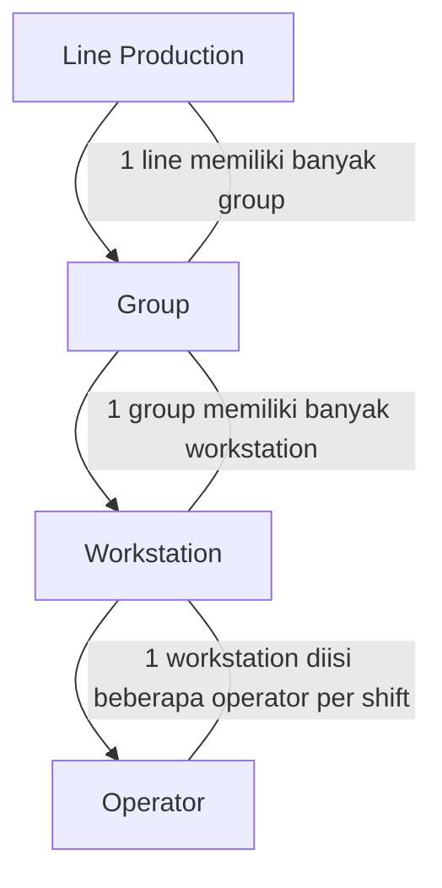
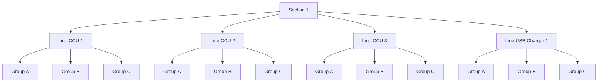
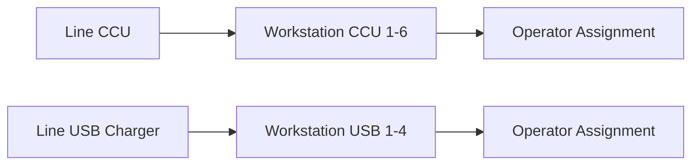
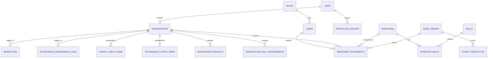

# Smart Manufacturing MES
## Dokumentasi Proyek

**Nama Proyek:** C-PRO <br>Chao Long Production System  
**Perusahaan:** PT Chao Long Motor Parts Indonesia  
**Jenis Dokumen:** Dokumentasi Proyek  
**Versi:** 1.0  
**Klasifikasi:** Internal

Database menggunakan Supabase lokal.

### Setup Supabase Lokal Terpisah

Project ini sudah disiapkan untuk Supabase local yang terpisah dari project lain. Konfigurasi ada di folder `supabase/` dengan port yang tidak bentrok:

- API: `54329`
- Database: `54330`
- Studio: `54331`
- Inbucket: `54332`

Langkah cepat:

1. Install Supabase CLI.
2. Jalankan `supabase start` dari root project ini.
3. Isi `.env` dari `.env.example`.
4. Gunakan `VITE_SUPABASE_URL` dan `VITE_SUPABASE_ANON_KEY` untuk frontend.

Jika ada project Supabase local lain yang sedang aktif, biarkan tetap berjalan karena project ini memakai port berbeda.

---

## Daftar Isi

1. [Gambaran Proyek](#1-gambaran-proyek)
2. [Tujuan Utama](#2-tujuan-utama)
3. [Arsitektur Sistem](#3-arsitektur-sistem)
4. [Hierarki Pengguna & Hak Akses](#4-hierarki-pengguna--hak-akses)
5. [Struktur Manufaktur Perusahaan](#5-struktur-manufaktur-perusahaan)
6. [Manajemen Shift & Waktu Kerja](#6-manajemen-shift--waktu-kerja)
7. [Manajemen Work Order (WO)](#7-manajemen-work-order-wo)
8. [Sistem Validasi 5M1E](#8-sistem-validasi-5m1e)
9. [Sistem Skill Matrix](#9-sistem-skill-matrix)
10. [Manajemen Operator](#10-manajemen-operator)
11. [Manajemen Workstation](#11-manajemen-workstation)
12. [Manajemen Tenaga Kerja Dinamis](#12-manajemen-tenaga-kerja-dinamis)
13. [Sistem Pemeliharaan Mandiri](#13-sistem-pemeliharaan-mandiri)
14. [Sistem Manajemen Inspeksi](#14-sistem-manajemen-inspeksi)
15. [Pengawasan Produksi Per Jam](#15-pengawasan-produksi-per-jam)
16. [Sistem Andon](#16-sistem-andon)
17. [Sistem Penyeimbangan Lini](#17-sistem-penyeimbangan-lini)
18. [Sistem OEE](#18-sistem-oee)
19. [Mesin Rekomendasi](#19-mesin-rekomendasi)
20. [Sistem Pelaporan](#20-sistem-pelaporan)
21. [Sistem Dashboard](#21-sistem-dashboard)
22. [Tumpukan Teknologi](#22-tumpukan-teknologi)
23. [Skema Database](#23-skema-database)
24. [Data Master Item Cek Tambahan](#24-data-master-item-cek-tambahan)
25. [Tahap Pengembangan](#25-tahap-pengembangan)

---

## 1. Gambaran Proyek

C-PRO adalah versi Lokal/Internal **Manufacturing Execution System (MES)** yang dirancang untuk mendukung operasional produksi di PT Chao Long Motor Parts Indonesia. Sistem ini mengintegrasikan monitoring produksi realtime, validasi proses, manajemen sumber daya manusia, hingga analitik berbasis AI.

### Target Industri

- Otomotif
- Elektronik
- Perakitan
- Pabrik Cerdas

### Modul Utama

| No | Modul | Deskripsi |
|----|-------|-----------|
| 1 | Manufacturing Execution System (MES) | Core eksekusi dan monitoring produksi |
| 2 | Layer Management System (LMS) | Manajemen lapisan produksi |
| 3 | Smart Andon System | Sistem eskalasi realtime |
| 4 | Dynamic Workforce Management | Manajemen tenaga kerja dinamis |
| 5 | Skill Matrix Validation | Validasi kompetensi operator |
| 6 | Autonomous Maintenance | Pemeliharaan mandiri workstation berbasis master AM check item |
| 7 | Digital Inspection System | Sistem inspeksi digital termasuk master 5F/5L check item |
| 8 | Dynamic Line Balancing | Penyeimbangan lini produksi |
| 9 | Manufacturing Analytics | Analitik dan prediksi berbasis data |
| 10 | Smart Factory Platform | Platform terintegrasi smart factory |

---

## 2. Tujuan Utama

Sistem ini dirancang untuk memenuhi sembilan tujuan utama operasional:

| No | Tujuan |
|----|--------|
| 1 | Memastikan line tetap berjalan walaupun ada manpower shortage |
| 2 | Memastikan setiap workstation diisi operator yang sesuai skill |
| 3 | Memastikan seluruh aktivitas produksi tervalidasi dan terdokumentasi |
| 4 | Memastikan autonomous maintenance dilakukan |
| 5 | Memastikan first inspection dan last inspection dilakukan |
| 6 | Memastikan realtime monitoring produksi |
| 7 | Menyediakan realtime andon escalation |
| 8 | Menyediakan line balance analysis |
| 9 | Menyediakan rekomendasi dan analisis prediktif |

---

## 3. Arsitektur Sistem

```
Smart Manufacturing MES
│
├── Authentication & Authorization
├── WO Management
├── Skill Matrix System
├── Dynamic Manpower Management
├── Autonomous Maintenance
├── Inspection Management
├── Hourly Production Monitoring
├── Andon System
├── Line Balancing System
├── Analytics Engine
├── Reporting System
└── Dashboard & Monitoring
```

### Realtime Technology

Sistem menggunakan teknologi realtime berikut:

- **WebSocket** — koneksi bidireksional persisten
- **Push Notification** — notifikasi instan ke device

### Ruang Lingkup Pemantauan Realtime

- Pemantauan produksi
- Pemantauan andon
- Pemantauan mesin
- Pemantauan operator

---

## 4. Hierarki Pengguna & Hak Akses

### Struktur Hierarki

```
Manager
 └── Assistant Manager
     └── Supervisor
         └── Leader
             └── Sub Leader
```

### Role Permission Matrix

| Role | Access Level | Deskripsi |
| Super Admin | Akses penuh sistem | Akses penuh ke seluruh sistem |
| Manager | Semua assistant manager & lini | Monitoring semua assistant manager dan lini |
| Assistant Manager | Semua supervisor, leader, dan lini | Monitoring semua supervisor, leader, dan lini |
| Supervisor | Semua leader & lini di bawah pengawasan | Monitoring leader dan lini di bawah supervisi |
| Leader | Semua sub leader & operator | Monitoring sub leader dan operator |
| Sub Leader | Input operasional | Input operasional harian |
| Operator | Hanya melihat / kehadiran | Lihat data dan absensi |

---

## 5. Struktur Manufaktur Perusahaan

### Struktur Kategori Produksi

PT Chao Long Motor Parts Indonesia memiliki struktur produksi sebagai berikut:
**Production Categories:**

| Category | Deskripsi |
|----------|-----------|
| SMT | Surface Mount Technology |
| Section 1 | CCU, USB Charger and Meter Assy |
| Section 2 | Speedometer, and Sensor |
**Product Categories:**

| Product Category | Deskripsi |
|-----------------|-----------|
| PCBA | Printed Circuit Board Assembly |
| Sub Assy | Sub Assembly products |

| Finished Good Type |
|--------------------|
| Meter Assy |
| Sensor |
| Others |

### Production Group Structure

Setiap line produksi memiliki group:

| Group |
|-------|
| Group A |
| Group B |
| Group C |

### Relasi Line -> Group -> Workstation -> Operator

Struktur operasional di project ini mengikuti hirarki berikut:



Skema tabel database yang direkomendasikan:

| Level | Tabel | Relasi Utama |
|-------|-------|--------------|
| Line Production | `lines` | `lines.id` direferensikan oleh `workstations.line_id` |
| Group | `production_groups` | Mengelompokkan line atau section produksi |
| Workstation | `workstations` | `workstations.line_id` → `lines.id` |
| Operator | `operators` | Di-assign ke workstation melalui `manpower_assignments` |

Hubungan assignment operasional:

| From | To | Tabel Penghubung | Catatan |
|------|----|------------------|---------|
| Line | Group | `production_groups` | Satu line dapat punya banyak group produksi |
| Group | Workstation | `workstations` | Workstation berada di dalam group/section tertentu |
| Workstation | Operator | `manpower_assignments` | Satu workstation dapat diisi beberapa operator per shift |

Contoh alur bisnis:

1. WO dibuat untuk sebuah line.
2. Sistem menentukan group dan daftar workstation yang terlibat.
3. Sistem membaca skill requirement tiap workstation.
4. Operator yang eligible di-assign ke workstation melalui `manpower_assignments`.
5. Jika ada shortage, sistem memicu rekomendasi manpower atau delegasi.
---

### Struktur Section 1

Section 1 adalah contoh area produksi yang terdiri dari beberapa line dan group kerja. Strukturnya sebagai berikut:



### Detail Line CCU / USB

Contoh mapping workstation di Section 1:

| Line | Group | Workstation |
|------|-------|-------------|
| Line CCU | Group CCU | Workstation CCU 1 |
| Line CCU | Group CCU | Workstation CCU 2 |
| Line CCU | Group CCU | Workstation CCU 3 |
| Line CCU | Group CCU | Workstation CCU 4 |
| Line CCU | Group CCU | Workstation CCU 5 |
| Line CCU | Group CCU | Workstation CCU 6 |
| Line USB Charger | Group USB Charger | Workstation USB 1 |
| Line USB Charger | Group USB Charger | Workstation USB 2 |
| Line USB Charger | Group USB Charger | Workstation USB 3 |
| Line USB Charger | Group USB Charger | Workstation USB 4 |




## 6. Manajemen Shift & Waktu Kerja

### Shift Types

| Shift Type | Durasi Kerja |
|-----------|-------------|
| Non shift type  | 8 jam kerja |
| 2 Shift type | 8 jam kerja |
| 3 shift type  | 7 jam kerja |
| Long Shift type | 12 jam kerja |

### Multiple Break Management

Setiap shift memiliki beberapa sesi istirahat:

| Break | Durasi |
|-------|--------|
| Break 1 | 15 menit |
| Break 2 | 30 menit |
| Break 3 | 15 menit |

> Durasi dapat berbeda tergantung tipe shift.

```
Non shift type
 └── Non shift/Regular
2 Shift type
 └── Shift 1 (8 jam kerja)
 └── Shift 2 (8 jam kerja)
3 shift type 
 └── Shift 1 (7 jam kerja)
 └── Shift 2 (7 jam kerja)
 └── Shift 3 (7 jam kerja)
Long shift type
 └── Shift 1 (12 jam kerja)
 └── Shift 2 (12 jam kerja)
```

### Friday Special Rule

Sistem wajib memperhitungkan aturan khusus hari Jumat:

- Waktu istirahat makan siang berbeda dari hari biasa (Senin-Kamis)
- Tambahan waktu sholat Jumat
- Jam kerja efektif shift 1 berbeda (Hanya Jam kerja shift 1 semua type shift yang berbeda)

**Friday System Requirements:**
- Menghitung effective working time hari Jumat
- Menyesuaikan target produksi
- Menyesuaikan cycle time analysis
- Menyesuaikan output prediction

### 40 Hours Per Week Rule

Untuk shift 7 jam:
- Terdapat tambahan hari kerja di hari Sabtu
- Digunakan untuk memenuhi 40 jam kerja per minggu

**Aturan Tambahan:** Jika `Shift = 7 jam kerja`, maka pada minggu tersebut operator wajib masuk pada hari Sabtu selama 5 jam kerja untuk memenuhi aturan 40 jam per minggu.

**System Requirements:**
- Menghitung total working hour mingguan
- Menghitung overtime
- Menghitung effective production time
- Menyesuaikan target berdasarkan shift type

### Effective Working Time Formulas

```
Effective Working Time = Total Shift Time - Total Break Time

Friday Effective Time = Shift Time - Break Time - Friday Prayer Break

Production Capacity = Effective Working Time / Ideal Cycle Time
```

### Dynamic Production Target

Target produksi harus dinamis berdasarkan:

- Shift type
- Effective working time
- Manpower
- Ideal cycle time
- Product type

### Line Balance Impact

Karena working time berbeda antar shift, line balance harus mempertimbangkan:

- Shift type
- Effective working time
- Break duration
- Friday adjustment
- Available manpower

### Database Structure — Shift

**Table: `shifts`**

| Field | Type |
|-------|------|
| Shift Name | VARCHAR |
| Shift Type | ENUM |
| Working Hour | DECIMAL |
| Active Status | BOOLEAN |
| Saturday Working | BOOLEAN |

**Table:  `shift_breaks`**

| Field | Type |
|-------|------|
| Shift ID | FK |
| Break Name | VARCHAR |
| Start Time | TIME |
| End Time | TIME |
| Duration | INTEGER (menit) |
| Friday Different | BOOLEAN |

---

## 7. Manajemen Work Order (WO)

### WO Functions

Work Order (WO) menentukan parameter produksi:

| Parameter | Keterangan |
|-----------|-----------|
| Product | Produk yang diproduksi |
| Production Line | Lini produksi yang digunakan |
| Planned Quantity | Target kuantitas produksi |
| Shift | Jadwal shift |
| Required Manpower | Kebutuhan tenaga kerja |
| Planned Cycle Time | Target cycle time |
| Workstation Assignment | Penugasan workstation |

### WO Flow

```
WO Released
    ↓
Line Preparation
    ↓
5M1E Validation
    ↓
Manpower Validation
    ↓
Check Autonomous Maintenance
    ↓
Inspection 5 First Product
    ↓
Production Start (Input by per Hour)
    ↓
Inspection 5 Last Product
```

---

## 8. Sistem Validasi 5M1E

### Komponen Validasi

| Factor | Metode Validasi |
|--------|----------------|
| Man | Skill matrix validation |
| Machine | Autonomous maintenance |
| Method | SOP verification |
| Material | Material readiness |
| Measurement | Measurement tools validation |
| Environment | Safety & environment check |

### Validation Output

Setiap validasi menghasilkan:

| Output | Keterangan |
|--------|-----------|
| Status | PASS / FAIL |
| Timestamp | Waktu validasi dilakukan |
| Checked By | PIC yang melakukan validasi |
| Photo Evidence | Dokumentasi foto |
| Remarks | Catatan tambahan |

---

## 9. Sistem Skill Matrix

### Konsep

Setiap workstation memiliki **minimum skill requirement**. Operator hanya dapat mengisi workstation jika:

```
Operator Skill Level >= Minimum Skill Requirement
```

### Skill Level

| Level | Description |
|-------|-------------|
| 1 | Belajar (Dengan pengawasan ketat) |
| 2 | Mampu (Mandiri) |
| 3 | Terampil (Analitikal) |
| 4 | Expert (Bisa Melatih) |

> **Validation Rule:** Minimal skill requirement adalah level **2 (Qualified)**.

---
### Manajemen Skill Matrix & Manpower (Detail)

Di bawah ini disajikan dokumentasi terperinci untuk mengimplementasikan manajemen Skill Matrix dan manpower: model data, alur proses, otomatisasi, metrik operasional, dan langkah implementasi berikutnya.

1) Model Data (Detail)

- `skills` — master daftar kemampuan/skill
    - Fields: `id UUID PK`, `code VARCHAR`, `name VARCHAR`, `description TEXT`
- `skill_levels` — definisi level kompetensi
    - Fields: `level INT PK`, `label VARCHAR`, `description TEXT`
- `operators` — data operator
    - Fields: `id UUID PK`, `nik VARCHAR UNIQUE`, `name VARCHAR`, `photo_url TEXT`, `active BOOLEAN`
- `operator_skills` — mapping operator → skill + level
    - Fields: `id UUID PK`, `operator_id UUID FK`, `skill_id UUID FK`, `level INT`, `assessed_at TIMESTAMPTZ`, `certified_until TIMESTAMPTZ`, `evidence_url TEXT`, `notes TEXT`
- `workstations` — konfigurasi workstation
    - Fields: `id UUID PK`, `line_id UUID FK`, `name VARCHAR`, `sequence INT`, `minimum_skill INT DEFAULT 2`, `ideal_cycle_time DECIMAL`
- `workstation_skill_requirements` — kebutuhan skill per workstation (multiple rows per WS)
    - Fields: `id UUID PK`, `workstation_id UUID FK`, `skill_id UUID NULL`, `minimum_level INT NOT NULL DEFAULT 2`, `required BOOLEAN DEFAULT TRUE`, `notes TEXT`
- `workstation_defaults` — default manpower mapping per WS per shift type
    - Fields: `id UUID PK`, `workstation_id UUID FK`, `default_headcount INT`, `default_role VARCHAR`, `shift_type VARCHAR`
- `manpower_assignments` — live assignment / historical
    - Fields: `id UUID PK`, `work_order_id UUID FK NULLABLE`, `workstation_id UUID FK`, `operator_id UUID FK`, `assigned_at TIMESTAMPTZ`, `assigned_by UUID`, `role VARCHAR`, `active BOOLEAN`

2) Contoh DDL + Seed Singkat

```sql
-- skill levels
CREATE TABLE skill_levels(level INT PRIMARY KEY, label VARCHAR, description TEXT);
INSERT INTO skill_levels(level,label,description) VALUES
(1,'Belajar','Dengan pengawasan ketat'),
(2,'Mampu','Mandiri'),
(3,'Terampil','Analitikal'),
(4,'Expert','Bisa melatih');

-- skills
CREATE TABLE skills(id UUID PRIMARY KEY DEFAULT gen_random_uuid(), code VARCHAR UNIQUE, name VARCHAR, description TEXT);
INSERT INTO skills(code,name) VALUES ('SOLDER','Soldering','Kemampuan solder manual dan reflow');

-- operators + operator_skills (contoh)
CREATE TABLE operators(id UUID PRIMARY KEY DEFAULT gen_random_uuid(), nik VARCHAR UNIQUE, name VARCHAR, photo_url TEXT, active BOOLEAN DEFAULT true);
CREATE TABLE operator_skills(id UUID PRIMARY KEY DEFAULT gen_random_uuid(), operator_id UUID REFERENCES operators(id), skill_id UUID REFERENCES skills(id), level INT, assessed_at TIMESTAMPTZ, certified_until TIMESTAMPTZ, notes TEXT);

-- workstation requirements
CREATE TABLE workstation_skill_requirements(id UUID PRIMARY KEY DEFAULT gen_random_uuid(), workstation_id UUID REFERENCES workstations(id), skill_id UUID NULL, minimum_level INT DEFAULT 2, notes TEXT);
CREATE TABLE workstation_defaults(id UUID PRIMARY KEY DEFAULT gen_random_uuid(), workstation_id UUID REFERENCES workstations(id), default_headcount INT DEFAULT 1, default_role VARCHAR, shift_type VARCHAR);
```

3) Proses & Validasi Assignment (Algoritma)

- Saat membuat/menjalankan assignment (manual atau otomatis), jalankan prosedur:
    1. Ambil row `workstation_skill_requirements` untuk `workstation_id`.
    2. Jika ada requirement spesifik (`skill_id` not null): periksa operator punya `operator_skills` dengan `skill_id` yang sama dan `level >= minimum_level`.
    3. Jika semua requirement terpenuhi → mark `eligible=true`.
    4. Jika ada requirement NULL → gunakan `workstations.minimum_skill` dan cek apakah operator memiliki *any* skill record dengan `level >= minimum_skill` (opsi: cek primary skill per operator).
    5. Jika tidak eligible: tergantung kebijakan, tampilkan alasan dan opsi (request approval / delegate).

Pseudocode singkat:

```pseudo
reqs = SELECT * FROM workstation_skill_requirements WHERE workstation_id = X;
for req in reqs:
    if req.skill_id is not null:
        ok = EXISTS (SELECT 1 FROM operator_skills WHERE operator_id=Y AND skill_id=req.skill_id AND level>=req.minimum_level)
    else:
        ok = EXISTS (SELECT 1 FROM operator_skills WHERE operator_id=Y AND level>=workstations.minimum_skill)
    if not ok: return not eligible(reason)
return eligible
```

4) Otomatisasi & Integrasi (Contoh implementasi)

- Supabase (Postgres) triggers / RLS:
    - Function `validate_assignment(workstation_id, operator_id)` yang mengembalikan BOOL + reason; dijalankan di API saat assignment.
    - Trigger on `manpower_assignments` BEFORE INSERT: panggil `validate_assignment`, batalkan insert jika hard-block.
- Background job / Edge function untuk rekomendasi:
    - Query eligible operators per WS dan prioritas (same line, same group, skill level desc, last_assessed desc).
    - Jika shortage, kirim notifikasi ke Sub Leader / Leader dengan opsi rekomendasi.
- Webhook / Notification flow:
    - Event `work_order.created` → populate `manpower_assignments` using `workstation_defaults` → run validate; jika shortage → emit `and-on` or `manpower.recommendation`.

5) Metrik Operasional & Query Contoh

- Skill Coverage (per line): % workstations yang punya >=1 eligible operator

SQL (coverage per line):
```sql
WITH ws_needed AS (
    SELECT w.id AS ws_id, w.line_id
    FROM workstations w
), eligible AS (
    SELECT DISTINCT wr.workstation_id
    FROM workstation_skill_requirements wr
    JOIN operator_skills os ON ( (wr.skill_id IS NOT NULL AND os.skill_id = wr.skill_id) OR (wr.skill_id IS NULL AND os.level >= wr.minimum_level) )
    JOIN operators o ON o.id = os.operator_id AND o.active = true
)
SELECT l.id AS line_id, 100.0 * SUM(CASE WHEN e.workstation_id IS NOT NULL THEN 1 ELSE 0 END) / COUNT(w.id) AS coverage_pct
FROM lines l
JOIN workstations w ON w.line_id = l.id
LEFT JOIN eligible e ON e.workstation_id = w.id
GROUP BY l.id;
```

- Shortage report (per shift): workstations where assigned < default_headcount
```sql
SELECT w.id, w.name, wd.default_headcount, COUNT(ma.id) AS assigned
FROM workstations w
LEFT JOIN workstation_defaults wd ON wd.workstation_id = w.id AND wd.shift_type = :shift_type
LEFT JOIN manpower_assignments ma ON ma.workstation_id = w.id AND ma.active = true
GROUP BY w.id, wd.default_headcount
HAVING COUNT(ma.id) < COALESCE(wd.default_headcount,1);
```

6) UI / UX detail

- Skill Matrix page
    - Grid: rows = operators, cols = skills; cell shows level, last assessed date, evidence link.
    - Filters: line, skill, level, active.
- Workstation Requirements page
    - List per line; modal untuk tambah requirement (skill + minimum_level) atau gunakan fallback minimum_skill.
- WO Creation flow
    - Side panel: recommended operators, color-coded eligibility. Buttons: `Apply Recommendation`, `Request Approval`.

7) Langkah Implementasi Prioritas (Roadmap 6–8 minggu)

- Week 1: Buat schema + migrations + seed minimal (`skill_levels`, `skills`, contoh operator`).
- Week 2: Implement `operator_skills` CRUD + UI Skill Matrix (read/write minimal).
- Week 3: Implement `workstation_skill_requirements` CRUD + UI Workstation Requirements.
- Week 4: Implement `validate_assignment` function, trigger, dan integrasi pada endpoint assignment.
- Week 5: Auto-suggest background job + notification workflow untuk shortage.
- Week 6: Metrics & dashboard (coverage, shortage heatmap), testing, dan dokumentasi.

8) Governance & Operasional

- Roles: hanya Supervisor/HR dapat mengubah `operator_skills.level` dan `certified_until`.
- Audit: simpan semua perubahan di `operator_skill_changes` (who, when, old_level, new_level, evidence_url).
- Assessment cadence: tentukan kebijakan (mis. re-assess tiap 3–6 bulan) dan buat reminder otomatis.

Jika Anda setuju, saya bisa:
- Buatkan migration SQL + seed file untuk semua tabel di atas, atau
- Implementasikan endpoint Supabase function `validate_assignment` dan contoh trigger, atau
- Scaffold halaman UI di `src/routes` untuk `Skill Matrix` dan `Workstation Requirements`.

Sebagai langkah selanjutnya, pilih opsi yang Anda mau saya kerjakan sekarang.


## 10. Manajemen Operator

### Fitur Operator

- Operator photo
- RFID validation
- Default line assignment
- Default workstation assignment
- Multi workstation capability
- Shift assignment
- Skill validation
- Attendance monitoring

### Operator Data Structure

| Field | Keterangan |
|-------|-----------|
| NIK | Nomor Induk Karyawan |
| Name | Nama operator |
| Photo | Foto operator |
| RFID | Kode RFID |
| Default Line | Lini produksi default |
| Default Workstation | Workstation default |
| Active Status | Status aktif/nonaktif |

---

## 11. Manajemen Workstation

### Workstation Features

| Feature | Keterangan |
|---------|-----------|
| Sequence | Urutan workstation dalam line |
| Skill Requirement | Minimum skill yang dibutuhkan |
| Ideal Cycle Time | Waktu siklus ideal |
| Autonomous Maintenance Checklist | Checklist perawatan mandiri |
| Inspection Standard | Standar inspeksi produk |

### Workstation Data Structure

| Field | Type |
|-------|------|
| Line ID | FK |
| Workstation Name | VARCHAR |
| Sequence | INTEGER |
| Minimum Skill | INTEGER (1–4) DEFAULT 2 |
| Ideal Cycle Time | DECIMAL (detik) |

### 11.1 Setup Skill Requirement per Workstation

Setiap workstation harus didefinisikan dengan `Minimum Skill` yang diperlukan agar sistem dapat otomatis memvalidasi operator saat assignment. Jika tidak dispesifikasikan, nilai default `Minimum Skill` untuk workstation baru adalah level **2**. Berikut panduan dan contoh format yang direkomendasikan:

| Field | Keterangan |
|-------|-----------|
| Workstation ID | UUID / kode unik workstation |
| Line ID | FK → lines.id |
| Group Name | Nama group produksi (mis. Group A) |
| Workstation Name | Nama workstation |
| Minimum Skill | Level minimal (1–4) |
| Notes | Catatan tambahan (tool khusus, sertifikasi) |

Contoh:

| Workstation ID | Line | Group | Workstation Name | Minimum Skill | Notes |
|---------------:|------|-------|------------------|---------------:|-------|
| WS-CCU-01 | Section 1 - CCU | Group A | Workstation CCU 1 | 2 | Standard assembly |
| WS-CCU-02 | Section 1 - CCU | Group A | Workstation CCU 2 | 3 | Requires soldering skill |

Implementasi tipikal: data ini disimpan di tabel `workstation_skill_requirements` dan digunakan dalam validasi assignment operator.

### 11.2 Mapping Default Manpower per Workstation

Setiap workstation juga perlu memiliki konfigurasi default manpower (jumlah operator dan peran default) per shift. Ini mempermudah auto-assignment saat WO dibuat.

| Field | Keterangan |
|-------|-----------|
| Workstation ID | FK → workstations.id |
| Line ID | FK → lines.id |
| Group Name | Nama group produksi |
| Default Headcount | Integer (jumlah operator default) |
| Default Role | Peran default (Operator / Sub Leader / Specialist) |
| Shift Type | Optional: non-shift / 2-shift / 3-shift |
| Notes | Keterangan tambahan |

Contoh mapping per group:

| Line | Group | Workstation | Default Headcount | Default Role |
|------|-------|------------|------------------:|--------------|
| Section 1 - CCU | Group A | Workstation CCU 1 | 1 | Operator |
| Section 1 - CCU | Group A | Workstation CCU 2 | 1 | Operator |
| Section 1 - USB | Group B | Workstation USB 1 | 1 | Operator |

System behavior:
- Saat WO dibuat, sistem membaca `workstation_skill_requirements` dan `workstation_defaults` untuk memvalidasi apakah assigned operator memenuhi persyaratan skill dan untuk menghitung kebutuhan manpower.
- Jika manpower shortage, sistem memicu rekomendasi: internal delegation, transfer, atau request tambahan.

---

---

## 12. Manajemen Tenaga Kerja Dinamis

### Objective

Menjamin line tetap berjalan ketika operator tidak hadir melalui mekanisme delegation dan transfer.

### Strategy Option 1 — Internal Delegation

Operator dalam line yang sama mendelegasi workstation tambahan.

**Validation:**

- Skill valid untuk workstation tambahan
- Shift aktif
- Workload dalam batas aman

### Strategy Option 2 — Transfer Operator

Jika internal delegation gagal atau tidak memungkinkan:

- Cari operator dari line lain
- Skill sesuai requirement workstation
- Memerlukan supervisor approval

### Operator Rotation

**Objective:**

| Tujuan |
|--------|
| Reduce operator fatigue |
| Increase flexibility |
| Improve multi-skill |
| Optimize manpower allocation |

**Validation Rotation:**

- Skill valid
- Training valid
- Shift aktif

### Additional Manpower Request

**Trigger Conditions:**

| Kondisi |
|---------|
| Output target tidak tercap|
| Terjadi bottleneck |
| Operator absent |
| High cycle time |

**Approval Flow:**

```
Sub Leader
    ↓
Leader
    ↓
Supervisor
```

---

## 13. Sistem Pemeliharaan Mandiri

### Konsep

Setiap workstation memiliki daftar item check autonomous maintenance yang wajib dilakukan sebelum produksi dimulai.

### Contoh Checklist — Gluing Workstation

| Item Check | Standard | Frequency | Metode |
|-----------|-----------|-----------|-----------|
| Air Blow Ionizer | Clean/No dust | Daily | Visually |
| Workbench | Clean/No dust | Daily | Visually |
| ESD Tray | Clean/No dust | Daily | Visually |

### Master Checklist Autonomous Maintenance

Tabel `autonomous_check_items` menjadi master item check per `line_id` dan `workstation_id`. Seed file memuat 121 item aktif untuk 2 line dan 13 workstation, seluruhnya berfrekuensi Harian. Kategori utama meliputi Kebersihan, Pengecekan Fungsi, Pengukuran, K3, Inspeksi, Pengencangan, dan Pengecekan Visual.

### Output Autonomous Maintenance

| Output | Keterangan |
|--------|-----------|
| Status | PASS / FAIL |
| Photo Evidence | Foto dokumentasi |
| Timestamp | Waktu pengecekan |
| Remarks | Catatan temuan |

---

## 14. Sistem Manajemen Inspeksi

### Konsep

Setiap produk memiliki dua jenis checksheet inspeksi:

- **First Inspection** — dilakukan di awal produksi
- **Last Inspection** — dilakukan di akhir produksi

### Master Checksheet 5F/5L

Tabel `fivef5l_check_items` menjadi master item checksheet 5F/5L per `line_id`, `workstation_id`, `sort_group`, dan `group_name`. Seed file memuat 28 item aktif untuk 2 line, 11 workstation, dan 15 kelompok proses. Tipe input yang digunakan adalah `ok_ng`, `float`, dan `text`.

### Inspection Items

| Item | Keterangan |
|------|-----------|
| Dimension | Pengukuran dimensi produk |
| Visual | Pemeriksaan visual |
| Parameter | Pengecekan parameter produksi |
| Jig Validation | Validasi jig dan fixture |
| Product Quality | Kualitas keseluruhan produk |

### Output Inspection

| Output | Keterangan |
|--------|-----------|
| Status | PASS / FAIL |
| Defect Summary | Ringkasan temuan defect |
| Photo Evidence | Dokumentasi foto |
| Inspection Report | Laporan resmi inspeksi |

### Contoh Checklist — Line CCU Product Model: D52-03

| Checking Point | Specification | Metode | Measurement results (N=1..5) | Judgment |
|---------------|---------------|--------|-------------------------------:|:--------:|
| Burning Program (BETA) — Voltage step 1 | 1.5 ~ 1.7 V | Visual | — | OK / NG |
| Burning Program (BETA) — Voltage step 2 | 3.0 ~ 3.4 V | Visual | — | OK / NG |
| Burning Program (BETA) — Programming Success | No error messages | Visual | — | OK / NG |
| Semi-Finished function inspection | Visual display — Result Inspection (PASS) | Visual | — | OK / NG |
| Burning Program (BT official) — Correct program version | BLE Software V2.E.04 | Visual | — | OK / NG |
| Burning Program (BT official) — Voltage 2 | 3.0 ~ 3.4 V | Visual | — | OK / NG |
| Burning Program (BT official) — Programming Success | No error messages | Visual | — | OK / NG |


---

## 15. Pengawasan Produksi Per Jam

### Input Per Jam

| Field | Keterangan |
|-------|-----------|
| Plan Qty | Target produksi per jam |
| Actual Qty | Realisasi produksi per jam |
| Loss Qty | Jumlah produk Defect |
| Downtime | Waktu henti (menit) |
| 5M1E Abnormality | Catatan abnormalitas 5M1E |

### Realtime Monitoring Output

| Monitor | Keterangan |
|---------|-----------|
| Plan vs Actual | Perbandingan target vs realisasi |
| Output Achievement | Persentase pencapaian output |
| Gap Analysis | Analisis kesenjangan produksi |
| Downtime Analysis | Analisis waktu henti mesin |

---

## 16. Sistem Andon

### Objective

Sistem eskalasi realtime untuk penanganan masalah produksi secara cepat dan terstruktur.

### Andon Types

| Type | Contoh |
|------|--------|
| Machine | Breakdown mesin |
| Quality | Defect issue |
| Material | Material shortage |
| Manpower | Operator shortage |
| Safety | Unsafe condition |
| Method | SOP issue |

### Andon Flow

```
Operator / Sub Leader
        ↓
Leader Notification
        ↓
Supervisor Escalation
        ↓
Manager Escalation
```

### Andon Status Color

| Color | Meaning |
|-------|---------|
| 🟢 Green | Normal — produksi berjalan baik |
| 🟡 Yellow | Warning — perlu perhatian |
| 🔴 Red | Stop — produksi berhenti |
| 🔵 Blue | Material request |

---

## 17. Sistem Penyeimbangan Lini

### Konsep

Setiap workstation memiliki ideal cycle time. Sistem secara otomatis mendeteksi ketidakseimbangan lini dan memberikan rekomendasi perbaikan.

### Tujuan Line Balancing

| Tujuan |
|--------|
| Detect bottleneck |
| Improve efficiency |
| Balance workload |
| Optimize manpower |

### Formulas

**Ideal Line Cycle Time:**
```
Ideal Line Cycle Time = Max(Workstation Cycle Time)
```

**Line Balance Efficiency:**
```
Line Balance Efficiency = Sum(Workstation Time) / (Workstation Count × Bottleneck Time)
```

**Adjusted Cycle Time (Dynamic):**
```
Adjusted Cycle Time = Standard Work Content / Assigned Manpower
```

**Output:**
```
Output = Available Time / Cycle Time
```

### Bottleneck Analysis

Sistem otomatis mendeteksi kondisi berikut:

| Kondisi | Keterangan |
|---------|-----------|
| Slow Workstation | Workstation dengan cycle time tinggi |
| Queue Buildup | Antrian produk yang menumpuk |
| Overload Workstation | Workstation dengan beban berlebih |
| Idle Workstation | Workstation tanpa aktivitas |

### Visualization

- Line balance chart
- Yamazumi chart
- Realtime workstation monitoring

---

## 18. Sistem OEE

### Formula OEE

**Availability:**
```
Availability = Operating Time / Planned Production Time
```

**Performance:**
```
Performance = (Ideal Cycle Time × Total Count) / Operating Time
```

**Quality:**
```
Quality = Good Count / Total Count
```

**Overall Equipment Effectiveness:**
```
OEE = Availability × Performance × Quality
```

---

## 19. Mesin Rekomendasi

### Smart Operator Replacement

merekomendasikan solusi manpower shortage:

- Internal delegation
- Transfer operator dari line lain
- Operator rotation

### Smart Line Balancing

menganalisis:

| Parameter | Keterangan |
|-----------|-----------|
| Bottleneck | Identifikasi titik bottleneck |
| Workload | Distribusi beban kerja |
| Cycle Time | Analisis cycle time aktual |
| Utilization | Tingkat utilisasi per workstation |

### Predictive Analysis

memprediksi risiko berikut:

| Prediksi | Keterangan |
|----------|-----------|
| Target Miss | Risiko tidak tercapainya target |
| Downtime Risk | Prediksi potensi downtime |
| Bottleneck Risk | Deteksi awal bottleneck |
| Overtime Probability | Kemungkinan overtime |

### Root Cause Analysis

membaca:

- Downtime history
- Manpower data
- Skill mismatch
- Material shortage

**Output Root Cause Analysis:**

- Root cause identification
- Rekomendasi tindakan korektif
- Improvement suggestion

---

## 20. Sistem Pelaporan

### Daily Reports

| Report | Keterangan |
|--------|-----------|
| Production Report | Laporan produksi harian |
| Downtime Report | Laporan downtime harian |
| Defect Report | Laporan defect harian |
| Manpower Report | Laporan kehadiran & assignment |
| Inspection Report | Laporan hasil inspeksi |
| Andon Report | Laporan insiden andon |

### KPI Reports

| KPI | Formula |
|-----|---------|
| OEE | Availability × Performance × Quality |
| Productivity | Output Aktual / Output Target |
| Efficiency | Effective Time / Available Time |
| Utilization | Operating Time / Available Time |
| Yield | Good Count / Total Count |

---

## 21. Sistem Dashboard

### Manager Dashboard

| Widget | Informasi |
|--------|-----------|
| OEE | Nilai OEE keseluruhan |
| Production Achievement | Persentase pencapaian produksi |
| Line Status | Status seluruh lini produksi |
| Andon Summary | Ringkasan insiden andon |
| Downtime | Total dan distribusi downtime |
| Efficiency | Efisiensi produksi |

### Supervisor Dashboard

| Widget | Informasi |
|--------|-----------|
| Multi Line Monitoring | Monitoring multi lini sekaligus |
| Escalation Monitoring | Monitoring eskalasi andon |
| Productivity Analysis | Analisis produktivitas shift |

### Leader Dashboard

| Widget | Informasi |
|--------|-----------|
| Shift Monitoring | Status shift aktif |
| Manpower Monitoring | Status kehadiran & assignment |
| Workstation Monitoring | Status per workstation |

### Sub Leader Dashboard

| Widget | Informasi |
|--------|-----------|
| Hourly Input | Form input produksi per jam |
| Andon Trigger | Tombol trigger andon |
| Inspection | Input hasil inspeksi |
| AM Checklist | Autonomous maintenance checklist |

---

## 22. Tumpukan Teknologi

### Frontend

| Technology | Keterangan |
|-----------|-----------|
| TanStack Start | Framework React yang digunakan |
| TailwindCSS | Utility-first CSS framework |
| Shadcn UI | Kumpulan komponen UI siap pakai |
| PWA Mobile | Aplikasi web progresif untuk mobile |

### Backend

| Technology | Keterangan |
|-----------|-----------|
| Supabase | Backend-as-a-Service (local) |
| PostgreSQL | Database relasional (melalui Supabase local) |
| Supabase Auth | Autentikasi & otorisasi |
| Supabase Storage | Penyimpanan file & foto |

### Integration

| Technology | Keterangan |
|-----------|-----------|
| OpenAI | Model utama |
| Gemini | Model alternatif |
| Kimi | Model tambahan |

### Pelaporan & Visualisasi

| Technology | Keterangan |
|-----------|-----------|
| Power BI | Pelaporan business intelligence |
| Grafana | Dashboard pemantauan & metrik |

### IoT Integration

| Technology | Keterangan |
|-----------|-----------|
| ESP32 | Mikrokontroler IoT |
| RFID | Validasi kartu identitas operator |
| QR Scanner | Scanning QR code produk & WO |

### Fitur Smart Factory

| Feature | Keterangan |
|---------|-----------|
| RFID Validation | Validasi operator masuk workstation |
| QR Tracking | Pelacakan produk dan WO |
| IoT Machine Monitoring | Pemantauan kondisi mesin via IoT |
| Predictive Maintenance | Prediksi kebutuhan pemeliharaan |
| Line Balancing | Optimalisasi lini produksi |
| Face Recognition | Pengenalan wajah operator |
| Auto Time Study | Studi waktu otomatis |
| Digital Gemba | Pemantauan lapangan secara digital |

---

## 23. Skema Database

### Master Tables

| Table | Deskripsi |
|-------|-----------|
| `users` | Data pengguna sistem |
| `roles` | Definisi peran dan akses |
| `operators` | Data operator produksi |
| `lines` | Konfigurasi lini produksi |
| `workstations` | Konfigurasi workstation |
| `products` | Master data produk |
| `machines` | Master data mesin |
| `skills` | Master data level skill |

### Transaction Tables

| Table | Deskripsi |
|-------|-----------|
| `work_orders` | Data work order aktif dan historis |
| `manpower_assignments` | Penugasan operator ke workstation |
| `operator_rotations` | Log rotasi operator |
| `operator_transfers` | Log transfer operator antar line |
| `autonomous_check_items` | Master item checklist autonomous maintenance |
| `autonomous_maintenance_logs` | Log checklist AM |
| `fivef5l_check_items` | Master item checksheet 5F/5L / inspection |
| `inspections` | Log hasil inspeksi |
| `hourly_production` | Input produksi per jam |
| `andon_logs` | Log insiden andon |
| `downtime_logs` | Log downtime produksi |

### Reporting Tables

| Table | Deskripsi |
|-------|-----------|
| `oee_reports` | Data OEE per shift/hari |
| `productivity_reports` | Data produktivitas |
| `defect_reports` | Data defect produksi |
| `efficiency_reports` | Data efisiensi lini |

### ERD Ringkas — Core Manufacturing Structure



Relasi inti yang perlu dipahami:

| Entitas | Relasi |
|---------|--------|
| `lines` | 1 line memiliki banyak `workstations` dan banyak `production_groups` |
| `workstations` | 1 workstation memiliki banyak requirement, default manpower, dan assignment operator |
| `operators` | 1 operator dapat punya banyak skill dan banyak assignment historis |
| `skills` | menjadi referensi master kompetensi untuk `operator_skills` |
| `work_orders` | memicu assignment manpower dan pencatatan output produksi |
| `autonomous_check_items` / `fivef5l_check_items` | menjadi master checklist berbasis workstation |

### ERD Detail — Skill Matrix & Manpower

```mermaid
erDiagram
    OPERATORS ||--o{ OPERATOR_SKILLS : has
    SKILLS ||--o{ OPERATOR_SKILLS : maps
    WORKSTATIONS ||--o{ WORKSTATION_SKILL_REQUIREMENTS : requires
    SKILLS ||--o{ WORKSTATION_SKILL_REQUIREMENTS : references
    WORKSTATIONS ||--o{ WORKSTATION_DEFAULTS : defaults
    WORKSTATIONS ||--o{ MANPOWER_ASSIGNMENTS : receives
    OPERATORS ||--o{ MANPOWER_ASSIGNMENTS : assigned
    WORK_ORDERS ||--o{ MANPOWER_ASSIGNMENTS : originates

    OPERATOR_SKILLS {
        uuid id PK
        uuid operator_id FK
        uuid skill_id FK
        int level
        timestamptz assessed_at
        timestamptz certified_until
        text evidence_url
        text notes
        timestamptz created_at
        timestamptz updated_at
    }

    WORKSTATION_SKILL_REQUIREMENTS {
        uuid id PK
        uuid workstation_id FK
        uuid skill_id FK_NULL
        int minimum_level
        boolean required
        text notes
        timestamptz created_at
        timestamptz updated_at
    }

    WORKSTATION_DEFAULTS {
        uuid id PK
        uuid workstation_id FK
        int default_headcount
        varchar default_role
        varchar shift_type
        text notes
        timestamptz created_at
        timestamptz updated_at
    }

    MANPOWER_ASSIGNMENTS {
        uuid id PK
        uuid work_order_id FK_NULL
        uuid workstation_id FK
        uuid operator_id FK
        varchar role
        timestamptz assigned_at
        uuid assigned_by FK_NULL
        boolean active
        text notes
        timestamptz created_at
        timestamptz updated_at
    }
```

| Tabel | Fungsi | Key Relasi |
|-------|--------|------------|
| `operator_skills` | Menyimpan level skill operator per skill | `operator_id` → `operators.id`, `skill_id` → `skills.id` |
| `workstation_skill_requirements` | Mendefinisikan requirement minimum skill per workstation | `workstation_id` → `workstations.id`, `skill_id` nullable |
| `workstation_defaults` | Menyimpan default manpower dan role per workstation/shift | `workstation_id` → `workstations.id`, unique per `shift_type` |
| `manpower_assignments` | Menyimpan assignment operator aktif/historis ke workstation | `workstation_id` → `workstations.id`, `operator_id` → `operators.id`, `work_order_id` nullable |

Aturan relasi operasional:

- `operator_skills` menentukan apakah operator eligible untuk penugasan.
- `workstation_skill_requirements` menentukan skill minimum yang wajib dipenuhi.
- `workstation_defaults` menentukan headcount default saat WO dibuat.
- `manpower_assignments` menjadi jembatan operasional antara WO, workstation, dan operator.

### ERD Terpadu — Work Order, Assignment, dan Skill

```mermaid
erDiagram
    WORK_ORDERS ||--o{ MANPOWER_ASSIGNMENTS : creates
    WORKSTATIONS ||--o{ MANPOWER_ASSIGNMENTS : receives
    OPERATORS ||--o{ MANPOWER_ASSIGNMENTS : assigned_to
    OPERATORS ||--o{ OPERATOR_SKILLS : has
    SKILLS ||--o{ OPERATOR_SKILLS : defines
    WORKSTATIONS ||--o{ WORKSTATION_SKILL_REQUIREMENTS : requires

    WORK_ORDERS {
        uuid id PK
        uuid line_id FK_NULL
        uuid product_id FK_NULL
        uuid shift_id FK_NULL
        numeric planned_quantity
        numeric planned_cycle_time
        int required_manpower
        varchar status
        timestamptz released_at
        timestamptz created_at
        timestamptz updated_at
    }

    MANPOWER_ASSIGNMENTS {
        uuid id PK
        uuid work_order_id FK_NULL
        uuid workstation_id FK
        uuid operator_id FK
        varchar role
        timestamptz assigned_at
        uuid assigned_by FK_NULL
        boolean active
        text notes
        timestamptz created_at
        timestamptz updated_at
    }

    OPERATOR_SKILLS {
        uuid id PK
        uuid operator_id FK
        uuid skill_id FK
        int level
        timestamptz assessed_at
        timestamptz certified_until
        text evidence_url
        text notes
        timestamptz created_at
        timestamptz updated_at
    }
```

Alur runtime validation yang direkomendasikan:

1. WO dirilis dan system membaca workstation yang terlibat.
2. Sistem mencari kandidat operator dari `operator_skills`.
3. `validateOperatorAssignment()` dipanggil saat preview assignment atau sebelum insert `manpower_assignments`.
4. Jika skill minimum tidak terpenuhi, assignment diberi status review atau diblokir.
5. Jika eligible, assignment disimpan dan dipakai untuk monitoring produksi.

### ERD Detail — Line, Group, dan Workstation

```mermaid
erDiagram
    LINES ||--o{ PRODUCTION_GROUPS : contains
    LINES ||--o{ WORKSTATIONS : hosts
    PRODUCTION_GROUPS ||--o{ WORKSTATIONS : organizes
    WORKSTATIONS ||--o{ WORKSTATION_SKILL_REQUIREMENTS : requires
    WORKSTATIONS ||--o{ WORKSTATION_DEFAULTS : defaults
    WORKSTATIONS ||--o{ MANPOWER_ASSIGNMENTS : receives

    LINES {
        uuid id PK
        varchar code
        varchar name
        varchar section
        boolean active
        uuid supervisor_id FK_NULL
        timestamptz created_at
        timestamptz updated_at
    }

    PRODUCTION_GROUPS {
        uuid id PK
        uuid line_id FK
        varchar group_name
        varchar category
        uuid supervisor_id FK_NULL
        int sort_order
        boolean active
        timestamptz created_at
        timestamptz updated_at
    }

    WORKSTATIONS {
        uuid id PK
        uuid line_id FK
        uuid group_id FK_NULL
        varchar name
        int sequence
        int minimum_skill
        numeric ideal_cycle_time
        boolean active
        timestamptz created_at
        timestamptz updated_at
    }
```

| Tabel | Fungsi | Key Relasi |
|-------|--------|------------|
| `lines` | Menyimpan line produksi per section / area | Direferensikan oleh `production_groups.line_id` dan `workstations.line_id` |
| `production_groups` | Mengelompokkan line berdasarkan group kerja | `line_id` → `lines.id`, bisa dipakai untuk rotasi manpower |
| `workstations` | Unit kerja spesifik yang diisi operator | `line_id` → `lines.id`, `group_id` nullable → `production_groups.id` |

Aturan operasional:

- `lines` adalah level paling atas untuk monitoring produksi, WO, dan reporting.
- `production_groups` dipakai untuk memisahkan zona kerja, leader assignment, dan balancing.
- `workstations` adalah level eksekusi tempat validasi skill, assignment operator, dan input hasil produksi berjalan.
- Jika `group_id` tidak diisi, workstation tetap terikat ke line melalui `line_id`.

### Additional Master Tables (Manufacturing Structure)

**Table: `production_groups`**

| Field | Type |
|-------|------|
| Group Name | VARCHAR |
| Category | ENUM (SMT, Sub Assy, Final Assy) |
| Supervisor | FK → users |

**Table: `production_categories`**

| Field | Type |
|-------|------|
| Category Name | VARCHAR |
| Description | TEXT |

**Table: `product_categories`**

| Field | Type |
|-------|------|
| Category Name | VARCHAR |
| Description | TEXT |

---

## 24. Data Master Item Cek Tambahan

### Additional Master Tables — Digital Check Items

Penambahan ini berasal dari file seed SQL `autonomous_check_items_rows.sql` dan `fivef5l_check_items_rows.sql`. Dua tabel berikut berfungsi sebagai master checklist agar proses AM dan 5F/5L tidak hanya tersimpan sebagai teks bebas pada log, tetapi memiliki item standar per line dan workstation.

**Table: `autonomous_check_items`**

| Field | Type | Constraint | Description |
| --- | --- | --- | --- |
| id | UUID | PK | Primary key |
| line_id | UUID | FK → lines.id | Line produksi pemilik item AM |
| workstation_id | UUID | FK → workstations.id | Workstation tempat item AM berlaku |
| code | VARCHAR(30) | NOT NULL UNIQUE | Kode item AM, contoh AM-FA-CCU-018 / AM-SA-CCU-042 |
| name | VARCHAR(150) | NOT NULL | Nama item check, misalnya Air Blow Ionizer, ESD PPE, Temperature Solder |
| category | VARCHAR(50) | NOT NULL | Kategori: Kebersihan, Pengecekan Fungsi, Pengukuran, K3, Inspeksi, Pengencangan, Pengecekan Visual |
| frequency | VARCHAR(30) | NOT NULL DEFAULT Harian | Frekuensi checklist |
| standard | TEXT | NOT NULL | Standar penerimaan item |
| method | VARCHAR(100) | NOT NULL | Metode pengecekan |
| sort_order | INTEGER | NOT NULL | Urutan tampil pada checksheet |
| active | BOOLEAN | DEFAULT true | Status item aktif |
| image_url | TEXT | NULLABLE | Referensi gambar standar bila diperlukan |


**Seed Summary — `autonomous_check_items_rows.sql`**

| Metric | Value |
| --- | --- |
| Total rows | 121 |
| Line scope | 2 line; prefix kode AM-FA: 73, AM-SA: 48 |
| Workstation scope | 13 workstation |
| Category distribution | Kebersihan: 37, Pengecekan Fungsi: 28, Pengukuran: 19, K3: 12, Inspeksi: 12, Pengencangan: 8, Pengecekan Visual: 5 |
| Method distribution | Pengecekan Visual: 92, Pengecekan Manual: 9, Pembersihan dengan ESD Brush: 8, Pengukuran dengan Temperature Checker: 4, Mengacu pada IPQC Check WI: 4, Pengecekan Label: 1, Pengecekan di bawah Lampu UV: 1, Pengukuran Berat (Weight Check): 1, Pengecekan Display & Visual: 1 |
| Frequency | Semua item Harian |


**Table: `fivef5l_check_items`**

| Field | Type | Constraint | Description |
| --- | --- | --- | --- |
| id | UUID | PK | Primary key |
| line_id | UUID | FK → lines.id | Line produksi pemilik item 5F/5L |
| workstation_id | UUID | FK → workstations.id | Workstation tempat item 5F/5L berlaku |
| sort_group | INTEGER | NOT NULL | Nomor kelompok proses/checksheet |
| group_name | VARCHAR(150) | NOT NULL | Nama kelompok proses, contoh Burning Program, Gluing, Label Printing |
| specification | TEXT | NOT NULL | Spesifikasi atau kriteria penerimaan |
| method | VARCHAR(50) | NOT NULL | Metode inspeksi, saat ini Visual |
| input_type | VARCHAR(20) | NOT NULL | Tipe input: ok_ng, float, text |
| sort_order | INTEGER | NOT NULL | Urutan tampil di dalam group |
| active | BOOLEAN | DEFAULT true | Status item aktif |
| created_at | TIMESTAMPTZ | DEFAULT now() | Timestamp seed/item dibuat |


**Seed Summary — `fivef5l_check_items_rows.sql`**

| Metric | Value |
| --- | --- |
| Total rows | 28 |
| Line scope | 2 line |
| Workstation scope | 11 workstation |
| Group scope | 15 group_name / 11 sort_group |
| Input types | ok_ng: 21, float: 5, text: 2 |
| Method | Semua item menggunakan Visual |


### Relasi Tambahan Check Items

| From Table | Cardinality | To Table | Notes |
|---|---:|---|---|
| `lines` | 1 : N | `autonomous_check_items` | Satu line memiliki banyak master item AM |
| `workstations` | 1 : N | `autonomous_check_items` | Item AM distandarkan per workstation |
| `autonomous_check_items` | 1 : N | `autonomous_maintenance_logs` | Log AM sebaiknya menyimpan `check_item_id` agar item historis tetap traceable |
| `lines` | 1 : N | `fivef5l_check_items` | Satu line memiliki banyak item 5F/5L |
| `workstations` | 1 : N | `fivef5l_check_items` | Item 5F/5L distandarkan per workstation |
| `fivef5l_check_items` | 1 : N | `inspections` | Inspeksi dapat mengacu ke `fivef5l_check_item_id` selain menyimpan snapshot item/specification |

### Update Struktur Log Operasional

Untuk menjaga kompatibilitas dengan desain awal, field teks `item_name` tetap dapat dipakai sebagai snapshot. Namun untuk data baru, tambahkan FK nullable berikut:

| Table | New Field | Type | Constraint | Purpose |
|---|---|---|---|---|
| `autonomous_maintenance_logs` | `check_item_id` | UUID | FK → autonomous_check_items.id NULLABLE | Menghubungkan hasil AM ke master item |
| `inspections` | `fivef5l_check_item_id` | UUID | FK → fivef5l_check_items.id NULLABLE | Menghubungkan hasil inspeksi/5F/5L ke master item |

## 25. Tahap Pengembangan

### Phase 1 — Foundation

| Deliverable |
|-------------|
| Authentication & authorization |
| Role management |
| WO management |
| Skill matrix |
| Manpower validation |

### Phase 2 — Core Operations

| Deliverable |
|-------------|
| Autonomous maintenance system |
| Inspection system |
| Hourly production monitoring |
| Andon system |

### Phase 3 — Analytics & OEE

| Deliverable |
|-------------|
| Line balancing system |
| OEE dashboard |
| Analytics & reporting |
| KPI reporting |

### Phase 4 — Smart Factory

| Deliverable |
|-------------|
| Recommendation Engine |
| Predictive analysis system |
| IoT integration |
| Smart factory features |

---

## Appendix — Standards Reference

### Manufacturing Standards Compliance

| Standard | Keterangan |
|----------|-----------|
| Lean Manufacturing | Eliminasi pemborosan (waste) |
| Toyota Production System (TPS) | Sistem produksi lean berbasis Toyota |
| Industry 4.0 | Integrasi digital-fisik di manufaktur |
| Smart Manufacturing | Manufaktur berbasis data dan fisik terintegrasi |
| Automotive Tier 1 Standard | Standar kualitas supplier tier 1 otomotif |

### Key Formulas Summary

| Formula | Rumus |
|---------|-------|
| Effective Working Time | `Total Shift Time - Total Break Time` |
| Friday Effective Time | `Shift Time - Break Time - Friday Prayer Break` |
| Production Capacity | `Effective Working Time / Ideal Cycle Time` |
| Ideal Line Cycle Time | `Max(Workstation Cycle Time)` |
| Line Balance Efficiency | `Sum(Workstation Time) / (Count × Bottleneck Time)` |
| Adjusted Cycle Time | `Standard Work Content / Assigned Manpower` |
| Output | `Available Time / Cycle Time` |
| Availability | `Operating Time / Planned Production Time` |
| Performance | `(Ideal Cycle Time × Total Count) / Operating Time` |
| Quality | `Good Count / Total Count` |
| OEE | `Availability × Performance × Quality` |

---

*Document generated for Smart Manufacturing MES — PT Chao Long Motor Parts Indonesia*  
*Version 1.0 | May 2026*
